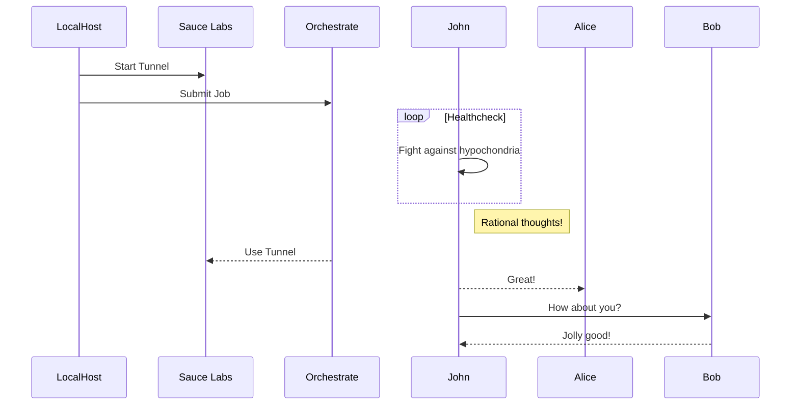

### Sauce Orchestrate for Custom Workloads


Run any Non-Webdriver Workload on Sauce Labs!  
- [ ] Sauce Connect Tunnel
- [ ] Save Test Artifacts


Let's use Postman's command-line collector runner [_Newman_](https://github.com/postmanlabs/newman).


```sh
docker pull postman/newman
newman run examples/sample-collection.json --reporters cli,json,junit


docker run -v ~/collections:/etc/postman -t postman/newman \
    https://www.getpostman.com/collections/df0a40ef41d570c48154 \
    --environment="HTTPBinNewmanTest.json.postman_environment" \
    --reporters junit --reporter-junit-export="newman-report.xml"


docker run -t --platform linux/amd64 postman/newman run "https://www.getpostman.com/collections/8a0c9bc08f062d12dcda" --reporters cli,json,junit  --reporter-junit-export="newman-report.xml"

# Mount host collections folder ~/collections, onto /etc/newman on the docker image, so that newman
# has access to collections
docker run -v ~/collections:/etc/newman -t postman/newman:alpine HTTPBinNewmanTest.json.postman_collection


docker run --rm -it --platform linux/amd64 --entrypoint sh postman/newman_alpine33:latest
docker run --platform linux/amd64 -t postman/newman_alpine33 run https://www.getpostman.com/collections/8a0c9bc08f062d12dcda


--ssl-client-cert /etc/newman/cacert.pem --ssl-extra-ca-certs /etc/newman/cacert.pem

saucectlOptions="--verbose --disable-usage-metrics --region ${SAUCE_REGION}"
$(printf %s ${saucectlOptions})

```bash
# run charles/mitmproxy listen on port 8888
sc --config-file config-proxy.yml

# orchestrate for newman postman collection
BUILD_ID=$(date +"%Y-%m-%d_%H%M%S") saucectl run --config config-newman.yml

# set the runID and pull the console output and uploaded artifacts 
runID=""
saucectl imagerunner logs ${runID} --region ${SAUCE_REGION} 
saucectl imagerunner artifacts download ${runID} "*" --target-dir artifacts/${runID} --out json --region ${SAUCE_REGION}
```
--volume="/home/postman/collections:/etc/newman"

[Newman Docker Hub]: https://hub.docker.com/r/postman/newman/


https://github.com/mermaid-js/mermaid



```mermaid
                                                    sauce connect            >   tunnel vm
sauce control                                                               >   orchestrate 

                                piestry         <   charles < sauce connect <   orchestrate
|--- control layer ---||----- app layer -----| |--- transport layer -------| |-- sauce labs--|
|---------------------------  localhost  ----------------------------------| |-- sauce labs--|
```


origin  git@github.com:postmanlabs/newman.git (fetch)
origin  git@github.com:postmanlabs/newman.git (push)  